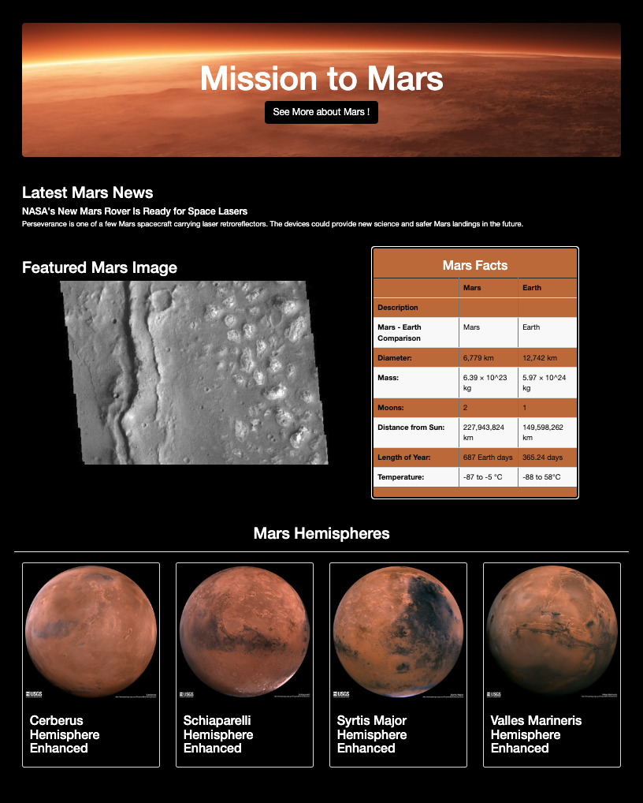

# Mission-to-Mars

## Project Overview
- We are creating a website by scraping several other websites to keep our content up-to-date. In this project, we will use splinter, beautiful soup and webdriver manager to read and scrape the data to our website. We will also use mongo data base (mars_app database and mars collection under that database) to store and deliver the data to our website. 

